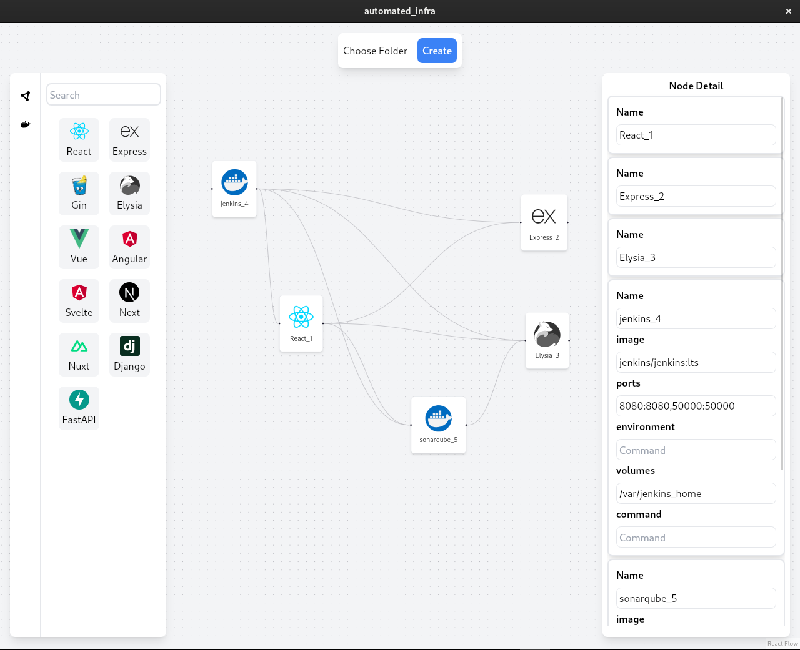

# ArchMap

ArchMap is a **Diagrams as Infrastructure** application used to create diagrams and use those diagrams to create cloud services or local services. It supports popular cloud platforms such as:

- **AWS** (EC2, RDS, EMR, Route53, etc.)
- **Azure** (App Services, SQL Database, etc.)
- **GCP** (Compute Engine, App Engine, Cloud Functions, etc.)

Using tools like **Ansible**, **Terraform**, and Cloud SDKs, ArchMap simplifies infrastructure management.



## Supported Web Services

ArchMap supports the following web services:

<ul>
  <li><strong>React</strong></li>
  <li><strong>Express</strong></li>
  <li><strong>Gin</strong></li>
  <li><strong>Elysia</strong></li>
  <li><strong>Vue</strong></li>
  <li><strong>Angular</strong></li>
  <li><strong>Svelte</strong></li>
  <li><strong>Next</strong></li>
  <li><strong>Nuxt</strong></li>
  <li><strong>Django</strong></li>
  <li><strong>FastAPI</strong></li>
</ul>

## Docker-Compose Support

ArchMap can create Docker images for all your services. It simplifies the process of defining and managing multi-container Docker applications.

<p><strong>Note:</strong> ArchMap can create Docker Compose configurations for various setups seamlessly.</p>

## Features:

-  **Automatic Diagram Generation** for Cloud Architecture
-  **Cloud Integration** with AWS, Azure, and GCP
-  **Infrastructure as Code** using Terraform and Ansible
-  **Docker Support** for Containerized Services
-  **Kubernetes Support** for Clustering Services
-  **HELM Support** for Clustering Services

## INSTALLATION

<p>Git Clone Project</p>

```bash
	git clone https://github.com/ITPATJIDR/ArchMap.git
```

<p>Install Dependency</p>

```bash
	Yarn
```

<p>Setup Ansible</p>

```bash
	cd /src-tauri/src/utils/ansible
	./setup_ansible.sh
```

# Support
If you have any questions or need assistance, feel free to reach out!

